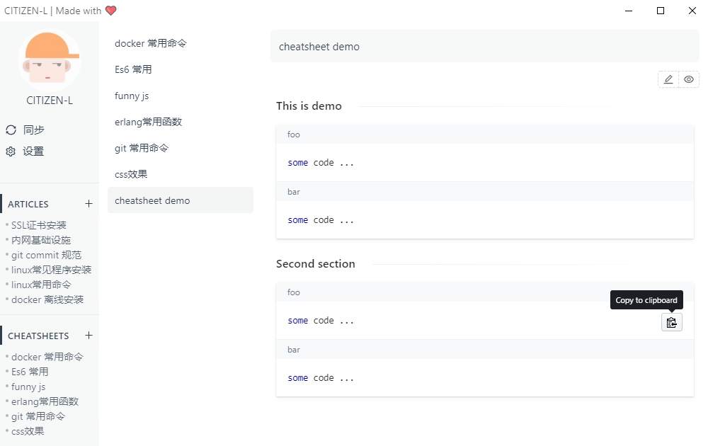
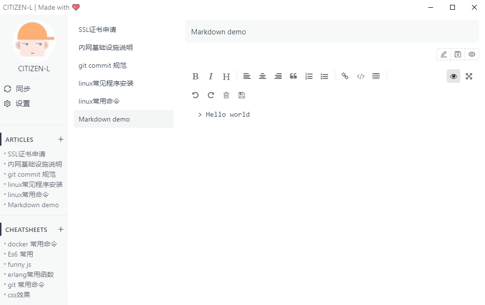

# SimpleNotes


**SimpleNotes** is a code snippet manager based on _GitHub Gist_

-   Unlimited private snippets
-   Markdown support
-   Free

cheatsheet

article


## Tech Stack

1. Framework: [Electron](http://electron.atom.io/)
2. Bundler: [ElectronVue](https://github.com/SimulatedGREG/electron-vue) [Webpack](http://webpack.github.io/docs/), [Babel](https://babeljs.io), [electron-builder](https://github.com/electron-userland/electron-builder)
3. Language: [ES6](https://babeljs.io/docs/learn-es2015/)
4. Library: [Vue](https://vuejs.org), [Vuex](https://vuex.vuejs.com)

#### Build Setup

```bash
# install dependencies
npm install

# serve with hot reload at localhost:9080
npm run dev

# build electron application for production
npm run build


```
